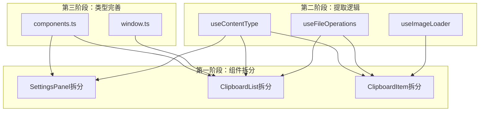

## 重构目标

1. **组件拆分** - 将超大型组件拆分为职责单一的小组件
2. **逻辑复用** - 提取重复逻辑到可复用的composables和utils
3. **类型完善** - 补充缺失的类型定义
4. **代码清理** - 删除注释代码，统一代码风格

---

## 第一阶段：组件拆分

### 1.1 拆分 SettingsPanel.vue (2074行 → 多个小组件)

目标文件结构：

```
src/components/settings/
├── SettingsPanel.vue          # 主容器 (~200行)
├── sections/
│   ├── ClipboardSection.vue   # 剪贴板设置 (~250行)
│   ├── HistorySection.vue     # 历史记录设置 (~150行)
│   ├── GeneralSection.vue     # 通用设置 (~150行)
│   ├── HotkeySection.vue      # 快捷键设置 (~300行)
│   ├── BackupSection.vue      # 备份设置 (~200行)
│   └── AboutSection.vue       # 关于页面 (~250行)
└── components/
    ├── NavItem.vue            # 导航项
    ├── SettingItem.vue        # 设置项通用组件
    ├── KeyRecorder.vue        # 按键录制组件
    └── PathDisplay.vue        # 路径显示组件
```

**关键改动**：`[src/components/SettingsPanel.vue](src/components/SettingsPanel.vue)` 中的各个设置区块将提取到独立的section组件中。

### 1.2 拆分 ClipboardList.vue (1545行)

目标文件结构：

```
src/components/clipboard/
├── ClipboardList.vue           # 主容器 (~300行)
├── TabBar.vue                 # 标签栏 (~150行)
├── SearchBar.vue              # 搜索栏 (~100行)
├── EmptyState.vue             # 空状态 (~50行)
└── composables/
    └── useKeyboardNavigation.ts  # 键盘导航逻辑 (~200行)
```

### 1.3 拆分 ClipboardItem.vue (969行)

目标文件结构：

```
src/components/item/
├── ClipboardItem.vue           # 主容器 (~200行)
├── previews/
│   ├── TextPreview.vue        # 文本预览 (~150行)
│   ├── ImagePreview.vue       # 图片预览 (~200行)
│   └── FilePreview.vue        # 文件预览 (~150行)
└── components/
    ├── TagList.vue            # 标签列表
    ├── QuickActions.vue       # 快捷操作按钮
    └── TypeBadge.vue          # 类型标签
```

---

## 第二阶段：提取重复逻辑

### 2.1 创建新的 Composables

**src/composables/useImageLoader.ts** - 图片加载逻辑

```typescript
export function useImageLoader() {
  const imageStates = ref<Map<string, ImageLoadState>>(new Map());
  
  const loadImage = async (src: string, maxRetries?: number) => { ... };
  const retryLoad = (src: string) => { ... };
  const getImageState = (src: string) => { ... };
  
  return { loadImage, retryLoad, getImageState };
}
```

**src/composables/useFileOperations.ts** - 文件操作

```typescript
export function useFileOperations() {
  const copyFilePath = async (path: string) => { ... };
  const formatFileSize = (bytes: number): string => { ... };
  const isImageFile = (filename: string): boolean => { ... };
  const openFile = async (path: string) => { ... };
  const showInFolder = async (path: string) => { ... };
  
  return { copyFilePath, formatFileSize, isImageFile, openFile, showInFolder };
}
```

**src/composables/useContentType.ts** - 内容类型相关

```typescript
export function useContentType() {
  const getTypeLabel = (type: ClipboardContentType): string => { ... };
  const getTypeIcon = (type: ClipboardContentType): string => { ... };
  const getTypeColor = (type: ClipboardContentType): string => { ... };
  
  return { getTypeLabel, getTypeIcon, getTypeColor };
}
```

### 2.2 创建 Utils

**src/utils/formatters.ts**

```typescript
export function formatRelativeTime(dateString: string): string { ... }
export function formatFileSize(bytes: number): string { ... }
export function getFileName(path: string): string { ... }
```

**src/utils/contentHelpers.ts**

```typescript
export function getTypeLabel(type: ClipboardContentType): string { ... }
export function isImageFile(filename: string): boolean { ... }
export function stripHtmlTags(html: string): string { ... }
```

---

## 第三阶段：类型完善

### 3.1 扩展类型定义

**src/types/window.ts** - 窗口扩展类型

```typescript
declare global {
  interface Window {
    __unlistenFocus?: () => void;
    __clipboardWindow?: WebviewWindow;
  }
}
```

**src/types/components.ts** - 组件相关类型

```typescript
export interface MenuItem {
  key: string;
  label: string;
  icon?: string;
}

export interface TabItem {
  key: string;
  label: string;
  isPinned?: boolean;
}
```

**更新 src/types/index.ts**

- 补充缺失的接口字段
- 统一命名规范

---

## 第四阶段：代码清理

### 4.1 删除注释代码

删除以下文件中的注释代码：

- `[src/components/ClipboardList.vue](src/components/ClipboardList.vue)` - 第53-68行、106-132行、674-689行的注释代码
- `[src/components/SmartSearch.vue](src/components/SmartSearch.vue)` - 第76-96行的注释代码
- `[src/components/ClipboardItem.vue](src/components/ClipboardItem.vue)` - 第448-493行的注释代码

### 4.2 统一代码风格

- 统一使用 `ref` 替代 `reactive`（遵循项目规范）
- 统一使用 `PascalCase` 命名组件
- 统一导入顺序：Vue API → Tauri API → 本地模块 → 样式

---

## 重构优先级

### P0 (高优先级)

1. 拆分 SettingsPanel.vue → 6个section组件
2. 提取图片加载逻辑到 useImageLoader.ts
3. 提取文件操作逻辑到 useFileOperations.ts

### P1 (中优先级)

1. 拆分 ClipboardList.vue → 主容器 + 子组件
2. 拆分 ClipboardItem.vue → 主容器 + 预览组件
3. 创建类型定义文件 (window.ts, components.ts)
4. 删除所有注释代码

### P2 (低优先级)

1. 拆分 SmartSearch.vue
2. 拆分 DrawerEditor.vue
3. 统一代码风格 (ref vs reactive)

---

## 依赖关系图




---

## 验证清单

重构完成后需要验证：

1. 类型检查通过：`pnpm run build` (包含 vue-tsc)
2. 功能测试：
  - 设置面板各Tab正常显示和切换
  - 剪贴板列表加载、搜索、过滤正常
  - 剪贴板项渲染正常（文本/图片/文件）
  - 键盘导航功能正常
  - 右键菜单功能正常
3. 无重复代码：图片加载、文件操作逻辑只存在于composables中

---

## 文件变更预估


| 操作类型          | 预估数量        |
| ------------- | ----------- |
| 修改现有文件        | 15+         |
| 新建组件文件        | 20+         |
| 新建composables | 3           |
| 新建utils       | 2           |
| 新建类型文件        | 2           |
| 删除代码行数        | ~500行（注释代码） |


---

## 风险与注意事项

1. **功能回归风险** - 重构后需要完整测试所有功能
2. **类型兼容性** - 确保新类型定义与后端Rust类型保持一致
3. **渐进式重构** - 建议按阶段进行，每个阶段完成后验证export const useAnnotationStore = defineStore('annotation-store', {
  state: () => ({
      file_tree_root_path: '',
      tree_current_node_data: null as NodeData | null,
    }),
    getters: {
      tree_current_node_path: (state) => {
        return state.tree_current_node_data?.path
      },
    },
    actions: {
      set_tree_current_node_data(node_data: NodeData) {
        this.tree_current_node_data = node_data
      },
    },
  })
  export default useAnnotationStore
  nekotick
4. **保留Git历史** - 使用 `git mv` 保留文件移动历史

