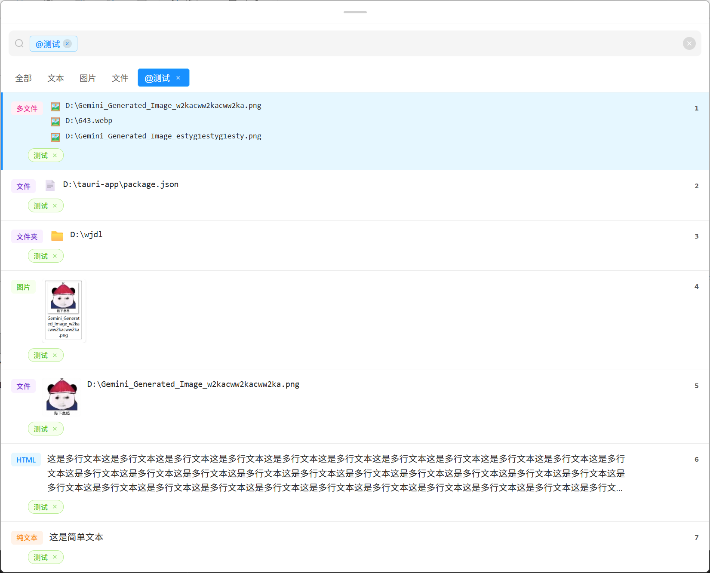

# 🚀 Paste Library - 你的智能剪贴板管家

  

  
  
  
  
  

## ✨ 复制的内容，再也找不到了？

**Last copied, never lost.**

Paste Library 是你的第二大脑——自动记录每一次复制，毫秒级召回任何内容。

<!-- ## 🎬 30 秒看懂 Paste Library

> **Alt+V** 呼出 → 输入关键词 → **回车粘贴**，全程不到 2 秒

--- -->

## ⭐ 为什么选择 Paste Library

- 🏆 **零学习成本**：Alt+V 即用，无需改变习惯
- ⚡ **极速响应**：本地 SQLite，百万条记录秒开
- 🔒 **隐私优先**：数据本地存储，不上传云端
- 🎯 **智能搜索**：拼音、首字母、容错，打错字也能找到

## 🎯 核心功能

| 功能                      | 说明                                                                 |
| :------------------------ | :------------------------------------------------------------------- |
| 📋 **全格式支持**         | 纯文本/HTML/富文本、图片（含缩略图）、文件/文件夹                    |
| 🔍 **模糊搜索**           | 拼音、首字母、容错搜索，支持 @标签 快速筛选                          |
| ⌨️ **全局快捷键**         | 默认 `Alt+V` 呼出/隐藏，支持自定义                                   |
| 🖱️ **灵活交互**           | 单击/双击可配置，右键菜单，跨应用拖拽，上下键导航，Ctrl+1-9 快捷粘贴 |
| 🛒 **批量粘贴（待实现）** | 购物车模式，多选内容按序批量粘贴                                     |
| 🏷️ **智能标签**           | 多标签分类管理，替代传统收藏                                         |
| ✏️ **即改即用**           | 文本即时编辑，图片预览放大                                           |

## 🚀 立即开始

### 下载安装

| 平台        | 下载                                                                                        |
| :---------- | :------------------------------------------------------------------------------------------ |
| **Windows** | [立即下载](https://download.upgrade.toolsetlink.com/download?appKey=C35buW3bHIOtdaVl3hym7g) |
| **macOS**   | [立即下载](https://download.upgrade.toolsetlink.com/download?appKey=C35buW3bHIOtdaVl3hym7g) |

## 📋 适用场景

| 场景   | Paste Library 如何帮你     |
| :----- | :------------------------- |
| 程序员 | 快速找回之前复制的代码片段 |
| 设计师 | 保存参考图片、设计素材     |
| 作家   | 积累写作素材，不用反复复制 |
| 客服   | 快速调用常用回复内容       |
| 学生   | 整理学习资料、笔记片段     |
| 办公   | 批量粘贴多条内容           |

## 🌟 未来规划

- [ ] 跨设备同步
- [ ] 深色主题
- [ ] 按日期范围筛选
- [ ] 多语言支持
- [ ] 虚拟滚动优化

## 📄 开源协议

MIT License - 自由使用，欢迎贡献！

  Built with ❤️ using Tauri + Vue

